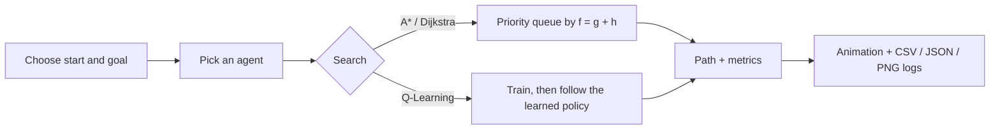

<div align="center">

# 🧭 Pathfinder: Heuristic Graph Pathfinding Agent

**Pick a start. Pick a destination. Watch the agent find the way.**

A search framework where virtual agents navigate grid mazes, with **A\***, **Dijkstra** and **Q-Learning** all written from scratch, plus live visualizations and performance logs.


</div>

---

## 📸 Preview

> 💡 **Add your screenshots here.** Save images in a `docs/` folder and replace the lines below.

| Interactive web app | Benchmark output |
|:---:|:---:|
|  |  |

---

## ✨ Features

- 🎯 **Choose your own start and destination** by clicking on the board.
- 🧱 **Draw walls and obstacles**, or generate random obstacle fields and twisty mazes.
- 🤖 **Four agents to compare:** Dijkstra, A\* (Manhattan), A\* (Euclidean) and Q-Learning.
- 🎬 **Live animation:** watch the search spread, then the agent runs along the final route.
- 📊 **Metrics tracked on every run:** path steps, runtime, nodes expanded and expanded-node density.
- 📁 **Exportable logs:** CSV, JSON and PNG visualizations of every run.
- 🌐 **Two versions:** a Python version (desktop window and batch benchmark) and a zero-install web version.

---

## 🧠 The agents

| Agent | Idea | Optimal path? | Strength |
|---|---|:---:|---|
| **Dijkstra** | Expands outward equally in all directions, like a ripple | ✅ | Reliable baseline |
| **A\* (Manhattan)** | Dijkstra plus a distance-to-goal guess that steers the search | ✅ | Fewest nodes on grids |
| **A\* (Euclidean)** | Same as A\*, but with a straight-line guess | ✅ | Admissible, but a weaker guide on 4-direction grids |
| **Q-Learning** | Learns by trial and error from rewards and penalties | ✅ (after training) | No map knowledge needed |

**A\* in one line:** always expand the cell with the lowest `f = g + h`, where `g` is the cost so far and `h` is the heuristic guess to the goal. Dijkstra is the same algorithm with `h = 0`.

**Q-Learning update rule:**

```
Q(s, a)  ←  Q(s, a) + α · [ reward + γ · max Q(s', a') − Q(s, a) ]
```

Rewards: `−1` per step, `−5` for hitting a wall, `+100` for reaching the goal.



---

## 🚀 Quick start

### 🐍 Python version

```bash
cd python_version
python -m venv venv
venv\Scripts\activate          # Windows  (Mac/Linux: source venv/bin/activate)
pip install -r requirements.txt

python app.py                  # interactive window
python main.py                 # full benchmark, saves to results/
python main.py --live          # live A* animation
python main.py --gif           # save the animation as a GIF
```

### 🌐 Web version

No installation needed. Open `web_version/index.html` in any browser. For auto-refresh while developing, use the **Live Server** extension in VS Code.

---

## 🎮 How to use

1. Choose **Place start** and click the board, then **Place destination** and click again.
2. Use **Draw walls** to add obstacles (click or drag).
3. Pick an agent and press **Run agent**.
4. Press **Compare all agents** to see every agent on the same maze.
5. Export the run log as **CSV / JSON**, or save the board as an **image**.

---

## 📈 Sample results

Benchmark on a 25 × 25 grid (`python main.py`). Every agent found the optimal path in every scenario.

| Scenario | Agent | Steps | Nodes expanded | Cells searched | Runtime |
|---|---|:---:|:---:|:---:|---:|
| Scattered 25% walls | Dijkstra | 48 | 458 | 98.1% | 0.8 ms |
| | **A\* (Manhattan)** | 48 | **215** | **46.0%** | 0.4 ms |
| | A\* (Euclidean) | 48 | 371 | 79.4% | 0.7 ms |
| | Q-Learning | 48 | 459 | 98.3% | 428.7 ms |
| Dense 35% walls | Dijkstra | 48 | 401 | 96.2% | 0.8 ms |
| | **A\* (Manhattan)** | 48 | **107** | **25.7%** | 0.3 ms |
| | A\* (Euclidean) | 48 | 205 | 49.2% | 0.4 ms |
| | Q-Learning | 48 | 402 | 96.4% | 467.8 ms |
| Twisty maze | Dijkstra | 256 | 337 | 100% | 0.6 ms |
| | A\* (Manhattan) | 256 | 317 | 94.1% | 0.5 ms |

### 🔍 Key findings

- **All agents find the same optimal path length**, so the real difference is how much work they do.
- **A\* with Manhattan distance searched about 4× fewer cells than Dijkstra** on the dense 35% wall grid (25.7% vs 96.2%).
- **A weaker heuristic helps less.** Euclidean A\* sits between Manhattan A\* and Dijkstra on grids with 4-direction movement.
- **Q-Learning reaches the optimum but pays for it in training time**, hundreds of times slower here.
- **In a one-route maze, heuristics barely help**, because there are few alternatives to rule out.

*Runtimes vary by machine. Run `python main.py` yourself to reproduce the table.*

---

## 🗂️ Project structure

```
pathfinding-agent/
├── python_version/
│   ├── algorithms.py      # A*, Dijkstra, Q-Learning (from scratch)
│   ├── grid.py            # obstacle fields, maze generator, solvability check
│   ├── main.py            # automated benchmark + visualization export
│   ├── app.py             # interactive desktop app (tkinter)
│   └── requirements.txt
├── web_version/
│   ├── index.html         # page structure
│   ├── style.css          # map-chart styling
│   └── script.js          # algorithms + animation + export (JavaScript)
├── docs/                  # screenshots
└── README.md
```

---

## 🛠️ Built with

- **Python 3**: algorithms, benchmarking and `tkinter` desktop UI
- **Matplotlib**: result charts and animations
- **HTML / CSS / JavaScript**: the browser version, with no libraries or dependencies

---

## 🔭 Ideas for future work

- [ ] Diagonal movement and weighted terrain (mud, water)
- [ ] More agents: Bidirectional A\*, Jump Point Search, Greedy Best-First
- [ ] Deep Q-Network (DQN) for larger or changing mazes
- [ ] Moving obstacles and dynamic replanning (D\* Lite)
- [ ] Averaging benchmarks over many random seeds with confidence intervals

---

## 📚 What I learned

- How heuristics trade extra computation for a much smaller search space
- Why admissible heuristics keep A\* optimal
- Designing reward functions for reinforcement learning
- Measuring and comparing algorithms fairly with consistent metrics

---

## 👤 Author

**Your Name**
🎓 Your College / Internship Organization
🔗 [GitHub](https://github.com/YOUR-USERNAME) · [LinkedIn](https://www.linkedin.com/in/YOUR-PROFILE)

---

<div align="center">

⭐ If you found this useful, consider giving the repository a star!

</div>
