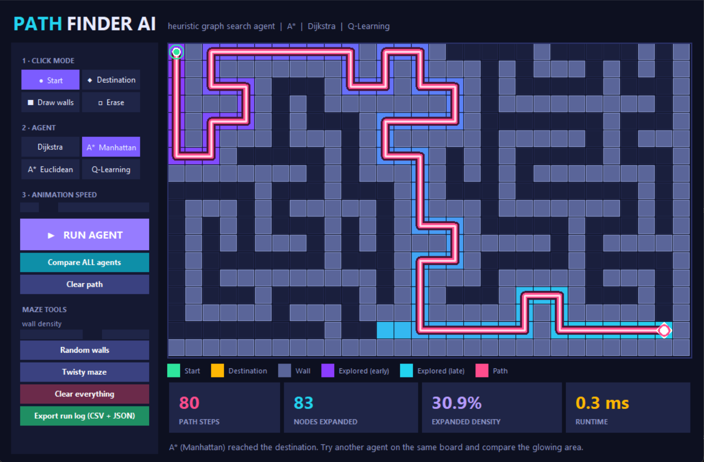
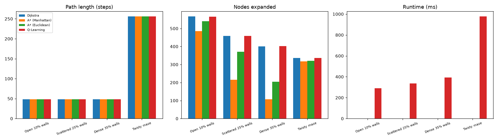
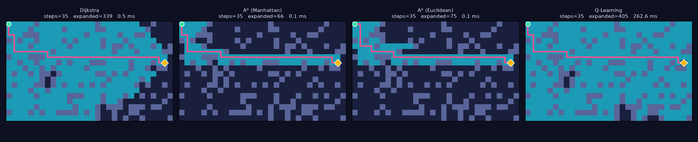
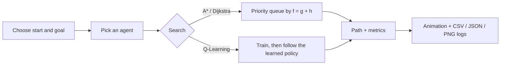

<div align="center">

# 🧭 PathFinder AI: Heuristic Graph Pathfinding Agent

**Pick a start. Pick a destination. Watch the agent find the way.**

A Python search framework where virtual agents navigate grid mazes, with **A\***, **Dijkstra** and **Q-Learning** all written from scratch, plus a live interactive app, performance metrics and exportable visualization logs.


</div>

---

## 📸 Preview

> 💡 **Add your screenshots here.** Save them in a `docs/` folder and keep the file names below (or edit the lines).
> - `docs/app.png`: a screenshot of the running `app.py` window (Windows + Shift + S)
> - `docs/summary_chart.png`: copy it from `results/summary_chart.png` after running `main.py`
> - `docs/comparison.png`: copy it from `results/comparison.png` after pressing **Compare ALL agents**

| Interactive app | Benchmark summary |
|:---:|:---:|
|  |  |



---

## ✨ Features

- 🎯 **Choose your own start and destination** by clicking on the board.
- 🧱 **Draw walls**, or generate random obstacle fields and twisty mazes.
- 🤖 **Four agents to compare:** Dijkstra, A\* (Manhattan), A\* (Euclidean) and Q-Learning.
- 🎬 **Live animation:** explored cells glow from purple to cyan, then the agent runs along a glowing pink route.
- 📊 **Metrics on every run:** path steps, runtime, nodes expanded and expanded-node density.
- 📁 **Exports:** CSV and JSON run logs, PNG comparison images, benchmark charts and an animated GIF.
- 📦 **Light on dependencies:** only `matplotlib`. The app window uses `tkinter`, which comes with Python.

---

## 🧠 The agents

| Agent | Idea | Optimal path? | Strength |
|---|---|:---:|---|
| **Dijkstra** | Expands outward equally in all directions, like a ripple | ✅ | Reliable baseline |
| **A\* (Manhattan)** | Dijkstra plus a distance-to-goal guess that steers the search | ✅ | Fewest nodes on grids |
| **A\* (Euclidean)** | Same as A\*, but with a straight-line guess | ✅ | Admissible, but a weaker guide on 4-direction grids |
| **Q-Learning** | Learns by trial and error from rewards and penalties | ✅ (after training) | Needs no map knowledge |

**A\* in one line:** always expand the cell with the lowest `f = g + h`, where `g` is the cost so far and `h` is the heuristic guess to the goal. Dijkstra is the same algorithm with `h = 0`.

**Q-Learning update rule:**

```
Q(s, a)  ←  Q(s, a) + α · [ reward + γ · max Q(s', a') − Q(s, a) ]
```

Rewards: `−1` per step, `−5` for hitting a wall, `+100` for reaching the goal.



---

## 🚀 Quick start

**Requirements:** Python 3.9 or newer (during installation on Windows, tick *"Add python.exe to PATH"*).

```bash
# 1. Get the code
git clone https://github.com/YOUR-USERNAME/YOUR-REPO.git
cd YOUR-REPO

# 2. Create and activate a virtual environment (Windows)
python -m venv venv
venv\Scripts\activate
#   Mac/Linux:  source venv/bin/activate

# 3. Install the dependency
pip install -r requirements.txt

# 4. Run it
python app.py            # interactive app: click start/destination and run agents
python main.py           # automatic benchmark on preset mazes -> results/
python main.py --live    # also open a live A* animation window
python main.py --gif     # also save the A* animation as a GIF
```

---

## 🎮 Using the interactive app (`app.py`)

1. Under **Click mode**, choose **Start**, then click a square on the board.
2. Choose **Destination**, then click another square.
3. Choose **Draw walls** to add obstacles (click or drag), or **Erase** to remove them.
4. Select an agent: **Dijkstra**, **A\* Manhattan**, **A\* Euclidean** or **Q-Learning**.
5. Press **▶ RUN AGENT** and watch the search. The stat cards show steps, nodes expanded, density and runtime.
6. Press **Compare ALL agents** to run all four on the same board and save `results/comparison.png`.
7. Use **Random walls**, **Twisty maze** and **Clear everything** to set up new boards.
8. Press **Export run log (CSV + JSON)** to save every run to `results/`.

> Q-Learning trains by trial and error first, so the window may pause for a second or two. That is normal.

---

## 📈 Sample results

Benchmark on a 25 × 25 grid (`python main.py`). Every agent found the optimal path in every scenario.

| Scenario | Agent | Steps | Nodes expanded | Cells searched | Runtime |
|---|---|:---:|:---:|:---:|---:|
| Scattered 25% walls | Dijkstra | 48 | 458 | 98.1% | 0.8 ms |
| | **A\* (Manhattan)** | 48 | **215** | **46.0%** | 0.4 ms |
| | A\* (Euclidean) | 48 | 371 | 79.4% | 0.7 ms |
| | Q-Learning | 48 | 459 | 98.3% | 428.7 ms |
| Dense 35% walls | Dijkstra | 48 | 401 | 96.2% | 0.8 ms |
| | **A\* (Manhattan)** | 48 | **107** | **25.7%** | 0.3 ms |
| | A\* (Euclidean) | 48 | 205 | 49.2% | 0.4 ms |
| | Q-Learning | 48 | 402 | 96.4% | 467.8 ms |
| Twisty maze | Dijkstra | 256 | 337 | 100% | 0.6 ms |
| | A\* (Manhattan) | 256 | 317 | 94.1% | 0.5 ms |

### 🔍 Key findings

- **All agents find the same optimal path length**, so the real difference is how much work they do.
- **A\* with Manhattan distance searched about 4× fewer cells than Dijkstra** on the dense 35% wall grid (25.7% vs 96.2%).
- **A weaker heuristic helps less.** Euclidean A\* sits between Manhattan A\* and Dijkstra on grids with 4-direction movement.
- **Q-Learning reaches the optimum but pays for it in training time**, hundreds of times slower here.
- **In a one-route maze, heuristics barely help**, because there are few alternatives to rule out.

*Runtimes vary by machine, while step and node counts are reproducible. Run `python main.py` to regenerate the table.*

---

## 📤 Output files

Everything is written to the `results/` folder:

| File | Created by | What it contains |
|---|---|---|
| `Open_10pct_walls.png`, `Scattered_25pct_walls.png`, `Dense_35pct_walls.png`, `Twisty_maze.png` | `main.py` | All four agents side by side on each maze |
| `summary_chart.png` | `main.py` | Bar charts of steps, nodes expanded and runtime |
| `metrics.csv` / `metrics.json` | `main.py` | Benchmark metrics for every scenario and agent |
| `astar_search.gif` | `main.py --gif` | Animation of A\* exploring the maze |
| `run_log.csv` / `run_log.json` | `app.py` | Every run you did in the interactive app |
| `comparison.png` | `app.py` | All agents compared on your own board |

---

## 🗂️ Project structure

```
├── app.py              # interactive app (tkinter): click start/goal, run agents
├── main.py             # automated benchmark + visualization export
├── algorithms.py       # A*, Dijkstra, Q-Learning (written from scratch)
├── grid.py             # obstacle fields, maze generator, solvability check
├── requirements.txt    # matplotlib
├── docs/               # screenshots for this README
└── results/            # generated outputs (created when you run the code)
```

---

## 🔧 Customizing

- **Board size for the benchmark:** change `SIZE = 25` in `main.py`.
- **Add a maze scenario:** add an entry to the `SCENARIOS` dictionary in `main.py`.
- **Add your own agent:** write a function with the same inputs and outputs as the ones in `algorithms.py`, then register it in the `ALGORITHMS` dictionary.
- **App colors:** edit the `theme` block at the top of `app.py`.

---

## 🔭 Ideas for future work

- [ ] Diagonal movement and weighted terrain (mud, water)
- [ ] More agents: Bidirectional A\*, Jump Point Search, Greedy Best-First
- [ ] Deep Q-Network (DQN) for larger or changing mazes
- [ ] Moving obstacles and dynamic replanning (D\* Lite)
- [ ] Averaging benchmarks over many random seeds with confidence intervals

---

## 📚 What I learned

- How heuristics trade extra computation for a much smaller search space
- Why admissible heuristics keep A\* optimal
- Designing reward functions for reinforcement learning
- Measuring and comparing algorithms fairly with consistent metrics

---

## 👤 Author

**Your Name**
🎓 Your College / Internship Organization
🔗 [GitHub](https://github.com/YOUR-USERNAME) · [LinkedIn](https://www.linkedin.com/in/YOUR-PROFILE)

---

<div align="center">

⭐ If you found this useful, consider giving the repository a star!

</div>
